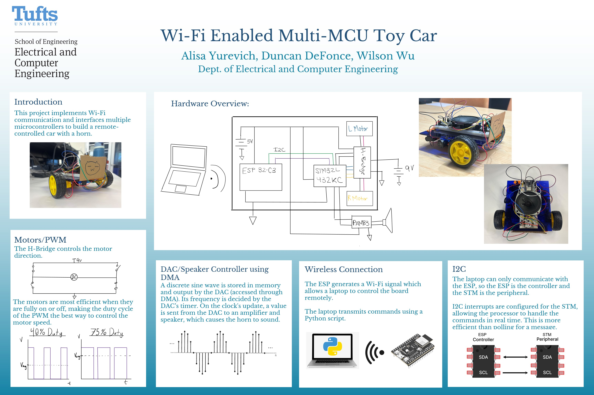

# **Embedded Smart Car with ESP32 & STM32**
This project implements an embedded smart RC car controlled via WiFi using an ESP32 and an STM32 microcontroller. The ESP32 acts as a soft Access Point (AP), creating a local WiFi network that your computer (client) can connect to. 

Once connected, the user runs a Python client on their computer terminal, which sends driving commands wirelessly to the ESP32 over WiFi. The ESP32 receives these commands and forwards them to the STM32 microcontroller via an I2C interface. The STM32 handles the low-level motor control and car behaviors.

This architecture separates communication and user interface (ESP32 and Python client) from real-time motor control (STM32), providing smooth, responsive control of the smart car via simple text commands.

## Hardware Used
- ESP32-C3
- STM32L432KC
  - H-Bridge Motor Driver
  - Two DC Brushless motors
  - 2 Wheels connected to motors.
  - 1 undriven wheel (back of car)
  - PAM83 Amplifier
  - Speaker

A 5V battery pack with a switch powers the ESP, STM and logic pin of the H-bridge in parrallel. A 9V battery with a switch powers the H-bridge to drive the motors.
  

## Features
- Front wheel drive
- Forward, Reverse, Left Turn, Right Turn, Accelerate, Deccelerate, Stop, Honk
  - These are the possible commands a client can input. 
- Pivot turning - one wheel's PWM is increased to turn

| Client command  | Effect | 
|-----------------|-----|
| W | Default drive forward | 
| A | Turn left. Once sent, wheels will spin @ different speeds until another command | 
| S | Deccelerate. Can be sent continously to get to a full stop |
| D | Turn right. Once sent, wheels will spin @ different speeds until another command |
| E | Accelerate. Can be sent continously to get to full speed |
| F | Immediate stop |
| H | Honk! Two beeps for each H sent |
| R | Reverse. All other commands will work while in reverse |

## Repo Structure

## Getting Started
### Pre-reqs:
- Platform IO/Arduino IDE (for ESP32)
- Platform IO/STM32CubeIDE (for STM32)
  
### How to Run:

## To Do's
### Mechanical
- Currently, both batteries drain fast when run for longer than an hour. A way to prevent this is to implement gears to reduce motor load.
- A Li-Po battery may also be more effective.
- A differential 

### Software
- In place turning -> spinning wheels in opposite directions to turn. The current turn implementation requires a bigger turning radius, while in-place turning s a maneuver where a vehicle turns around its own center without moving forward or backward.
